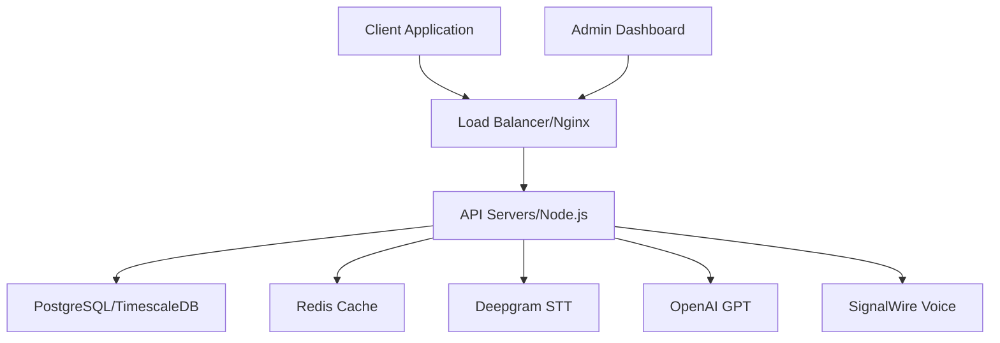

2. **architecture.md**
```markdown
# System Architecture

## Overview
The AI Voice Calling Agent is a distributed system designed to handle automated voice calls with AI-powered conversations. The system is built with scalability, reliability, and real-time processing in mind.

## System Components

### High-Level Architecture Diagram



## Component Details

### Frontend Layer
- **Client Application**: React/TypeScript SPA
  - Real-time call monitoring
  - WebSocket integration for live updates
  - Responsive design for mobile/desktop
- **Admin Dashboard**: React/TypeScript
  - User management
  - Call analytics and reporting
  - System configuration

### API Layer
- **Technology**: Node.js/Express
- **Features**:
  - RESTful API endpoints
  - WebSocket server for real-time updates
  - JWT authentication
  - Rate limiting
  - Request validation
  - Error handling
  - Logging and monitoring

### Data Layer
- **Primary Database**: PostgreSQL
  - User data
  - Call records
  - System configuration
- **TimescaleDB Extension**:
  - Time-series analytics
  - Call metrics
  - Performance data
- **Redis Cache**:
  - Session management
  - Rate limiting
  - Real-time data caching

### AI Services
- **Speech-to-Text**: Deepgram
  - Real-time transcription
  - Multiple language support
  - Custom vocabulary
- **Language Model**: OpenAI GPT-4
  - Context-aware responses
  - Dynamic conversation flow
  - Sentiment analysis
- **Text-to-Speech**: Custom Engine
  - Natural voice synthesis
  - Emotion modeling
  - Multiple voices/accents

### Telephony Integration
- **SignalWire SMPP**:
  - Voice call handling
  - Call quality monitoring
  - Call recording
  - DTMF handling

## Scalability and Reliability
- Horizontal scaling of API servers
- Database replication and failover
- Redis cluster for high availability
- Load balancing across multiple regions
- Automatic failover mechanisms
- Rate limiting and DDoS protection

## Security Measures
- SSL/TLS encryption
- JWT-based authentication
- API key management
- Role-based access control
- Data encryption at rest
- Regular security audits
- Input validation and sanitization

## Monitoring and Logging
- Prometheus metrics collection
- Grafana dashboards
- ELK stack for log aggregation
- Real-time alerting system
- Performance monitoring
- Error tracking and reporting

## Deployment
- Docker containerization
- Kubernetes orchestration
- CI/CD pipeline integration
- Blue-green deployment strategy
- Automated backup systems
- Environment-specific configurations